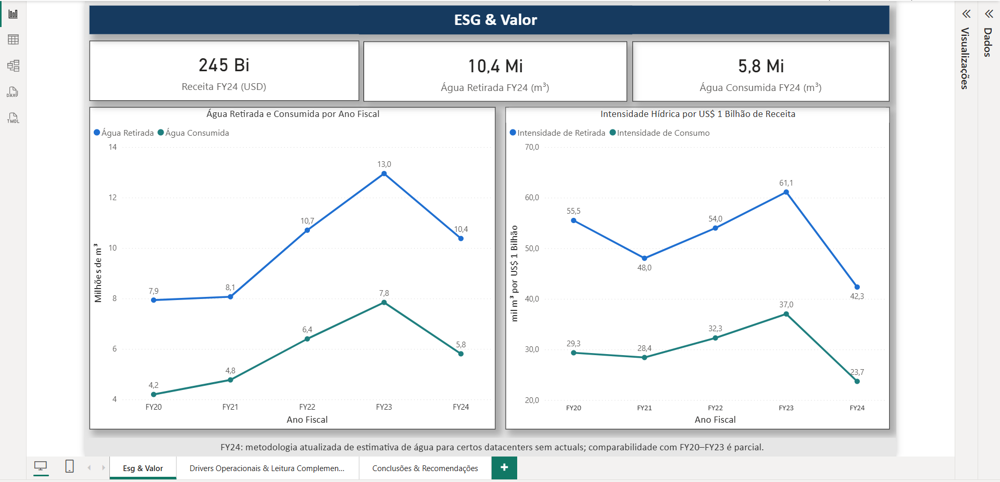
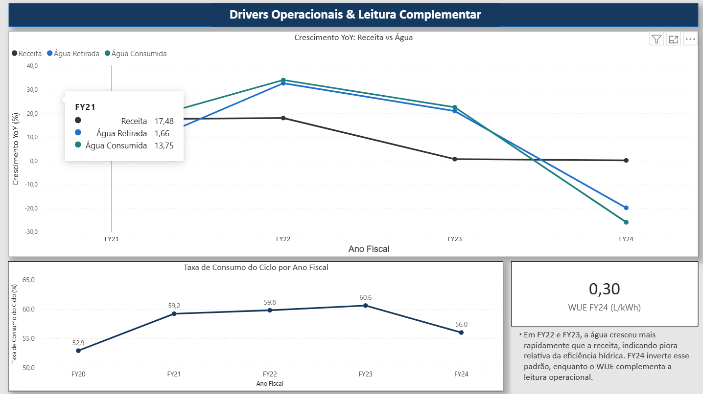
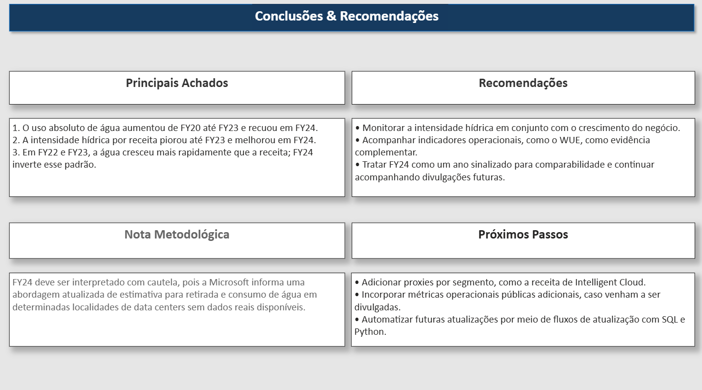

# Eficiência hídrica e governança ESG em data centers: análise do uso de água da Microsoft (FY20–FY24)
s# Eficiência hídrica e governança ESG em data centers: análise do uso de água da Microsoft (FY20–FY24)
(Initial commit - Microsoft water ESG analysis project)

Este projeto analisa a evolução do uso de água da Microsoft entre FY20 e FY24, conectando indicadores ESG corporativos a métricas de eficiência hídrica e geração de valor. A análise foi construída com SQL, Python e Power BI, com foco em retirada e consumo de água, intensidade hídrica por receita, comportamento Year over Year e um indicador operacional complementar de data center (WUE).

---

## Contexto e Motivação

Com a expansão de serviços em nuvem, inteligência artificial e infraestrutura digital, os data centers passaram a demandar volumes crescentes de energia e recursos para resfriamento. Dependendo da tecnologia utilizada, esse processo pode envolver uso relevante de água.

Nesse contexto, o monitoramento de indicadores hídricos passou a ganhar importância dentro da agenda ESG, especialmente em empresas de grande porte com forte presença em infraestrutura tecnológica. Avaliar retirada, consumo e intensidade hídrica por valor gerado ajuda a entender se o crescimento do negócio está sendo acompanhado por maior eficiência no uso de recursos.

A Microsoft foi escolhida como objeto de estudo por divulgar dados públicos consolidados de água e receita, o que permite construir uma análise quantitativa baseada em indicadores corporativos e em uma métrica operacional complementar de data center (WUE).

---

## Problema de Negócio

Com a expansão contínua de cloud, inteligência artificial e infraestrutura digital, torna-se importante entender se o crescimento do negócio está sendo acompanhado por maior eficiência hídrica. Em empresas com operação intensiva em data centers, o aumento da demanda tecnológica pode elevar a pressão sobre recursos naturais, tornando relevante o monitoramento de indicadores de retirada, consumo e intensidade de água.

Diante desse cenário, o problema de negócio deste projeto é avaliar se a evolução da receita da Microsoft entre FY20 e FY24 foi acompanhada por melhora ou piora relativa no uso de água, considerando também uma métrica operacional complementar de eficiência hídrica em data centers (WUE).

---

## Objetivo do Projeto

O objetivo deste projeto é avaliar a evolução do uso de água da Microsoft entre FY20 e FY24, medindo retirada, consumo e intensidade hídrica por receita, e complementando a análise com indicadores de tendência (YoY), ciclo de consumo e uma métrica operacional de data center (WUE).

A proposta é verificar se o crescimento da receita foi acompanhado por melhora ou piora relativa na eficiência hídrica, combinando uma visão corporativa consolidada com uma leitura operacional complementar.

---

## Dados e Fontes

A análise foi construída com base em dados públicos consolidados da Microsoft, combinando informações ambientais e financeiras entre FY20 e FY24.

### Dados utilizados
- **Water Withdrawn (m³):** volume anual de água retirada
- **Water Consumed (m³):** volume anual de água consumida
- **Revenue (USD):** receita anual consolidada
- **WUE (L/kWh):** métrica operacional complementar de eficiência hídrica em data centers

### Fontes principais
- **Microsoft Environmental Sustainability Report** — dados de água e indicador WUE
- **Microsoft Annual Report / Form 10-K** — dados de receita anual

### Observação metodológica
Os dados de FY24 foram mantidos na análise, mas tratados com cautela interpretativa devido à atualização metodológica reportada pela Microsoft para estimativas de água em determinadas localidades de data centers sem dados reais disponíveis.

---

## Ferramentas Utilizadas

- **MySQL / MariaDB** — modelagem do banco de dados, armazenamento das tabelas fato e dimensão, e criação das views analíticas
- **SQL** — construção do schema, joins, regras de integridade e cálculo de KPIs analíticos
- **Python (Pandas / SQLAlchemy)** — leitura do banco, validação dos dados, conferência dos KPIs e exportação da base final para uso no dashboard
- **Power BI** — construção do dashboard executivo em três páginas, com foco em visualização, interpretação e comunicação dos resultados
- **VS Code / Jupyter Notebook** — apoio ao desenvolvimento, testes, exploração dos dados e documentação do fluxo analítico

---

## Modelagem de Dados

O projeto foi estruturado em um banco relacional com uma dimensão temporal e três tabelas fato, permitindo separar informações de calendário fiscal, indicadores ambientais, dados financeiros e uma métrica operacional complementar.

### Estrutura principal
- **dim_fiscal_year** — dimensão com os anos fiscais FY20 a FY24
- **fact_water** — tabela fato com retirada e consumo de água por ano fiscal
- **fact_financials** — tabela fato com receita anual consolidada
- **fact_datacenter_efficiency** — tabela fato com o indicador operacional WUE (L/kWh)

### Camada analítica
A partir dessas tabelas, foram criadas views para consolidar a análise e facilitar o consumo no Python e no Power BI:

- **vw_water_finance_kpis** — integra água e receita, com cálculo de intensidade hídrica, crescimento Year over Year e taxa de consumo do ciclo
- **vw_water_finance_dc_kpis** — estende a view anterior com o indicador WUE, permitindo leitura complementar da eficiência operacional

---

## KPIs e Métricas Calculadas

Os principais indicadores calculados no projeto foram:

- **Withdrawn Intensity** = `water_withdrawn_m3 / revenue_usd`
- **Consumed Intensity** = `water_consumed_m3 / revenue_usd`
- **Withdrawn m³ per US$ 1 Billion** = intensidade de retirada ajustada para leitura executiva
- **Consumed m³ per US$ 1 Billion** = intensidade de consumo ajustada para leitura executiva
- **YoY Revenue Growth** = crescimento anual da receita
- **YoY Withdrawn Growth** = crescimento anual da água retirada
- **YoY Consumed Growth** = crescimento anual da água consumida
- **Cycle Consumption Rate** = `water_consumed_m3 / water_withdrawn_m3`
- **WUE (L/kWh)** = indicador operacional complementar de eficiência hídrica em data centers

Esses KPIs foram calculados em SQL por meio de views analíticas e validados em Python com conferência dos resultados.

---

## Etapas do Projeto

O desenvolvimento do projeto foi dividido em etapas sequenciais:

1. **Definição do escopo analítico**
   - delimitação do problema de negócio
   - escolha da empresa e do período
   - definição das métricas principais

2. **Coleta e organização dos dados**
   - extração dos dados públicos de água e receita
   - estruturação dos arquivos CSV
   - padronização de nomenclaturas e formatos

3. **Modelagem do banco de dados**
   - criação do schema relacional
   - definição de dimensão e tabelas fato
   - inclusão de regras de integridade e rastreabilidade

4. **Criação da camada analítica**
   - construção das views de KPIs em SQL
   - cálculo de intensidade, YoY e cycle rate
   - integração do indicador WUE

5. **Validação com Python**
   - leitura das tabelas e views
   - conferência dos anos fiscais
   - validação dos KPIs
   - geração de gráficos exploratórios

6. **Construção do dashboard**
   - criação das páginas no Power BI
   - ajuste visual dos gráficos e cards
   - organização narrativa das análises

7. **Documentação final**
   - README
   - dicionário de dados
   - organização da estrutura do repositório

---

## Dashboard

O dashboard final foi estruturado em três páginas, cada uma com uma função analítica específica.

### Página 1 — ESG & Valor
Apresenta a visão executiva principal do projeto:
- destaque dos números de FY24
- evolução da água retirada e consumida
- intensidade hídrica por US$ 1 bilhão de receita
- nota metodológica sobre FY24

**Objetivo da página:** mostrar a relação entre uso de água, geração de valor e comportamento recente da série.

---

### Página 2 — Drivers Operacionais & Leitura Complementar
Aprofunda a análise:
- crescimento YoY de receita versus água
- taxa de consumo do ciclo
- card com WUE FY24
- texto interpretativo com leitura executiva

**Objetivo da página:** explicar se a água cresceu mais rápido ou mais devagar que a receita e complementar a leitura com um indicador operacional.

---

### Página 3 — Conclusões & Recomendações
Fecha a análise com:
- principais achados
- recomendações
- nota metodológica
- próximos passos

**Objetivo da página:** transformar os resultados em síntese executiva e indicar possíveis evoluções do projeto.

### Página 1 — ESG & Valor


### Página 2 — Drivers Operacionais & Leitura Complementar


### Página 3 — Conclusões & Recomendações


---

## Principais Insights

A análise permitiu identificar os seguintes pontos principais:

1. **O uso absoluto de água cresceu continuamente de FY20 até FY23 e recuou em FY24.**

2. **A intensidade hídrica por receita piorou até FY23, sugerindo maior pressão relativa no uso de água em relação ao valor gerado.**

3. **FY24 apresentou melhora relevante nos indicadores de intensidade hídrica, mas com comparabilidade parcial devido à atualização metodológica reportada pela Microsoft.**

4. **Em FY22 e FY23, a água cresceu mais rapidamente que a receita, indicando piora relativa da eficiência hídrica. FY24 inverte esse padrão.**

5. **O WUE entra como uma evidência operacional complementar, agregando uma leitura adicional da eficiência hídrica em data centers.**

---

## Limitações

Este projeto possui algumas limitações importantes:

- Os dados de água são consolidados corporativamente, e não segmentados por produto, serviço ou região.
- A receita anual consolidada foi usada como proxy de valor gerado, mas não representa diretamente carga computacional ou uso específico de infraestrutura.
- FY24 deve ser interpretado com cautela devido à atualização metodológica informada pela Microsoft.
- O indicador WUE foi utilizado como complemento operacional, mas não substitui a análise corporativa consolidada de água.

---

## Próximos Passos

Como evolução futura, este projeto pode ser expandido com:

- inclusão de proxies mais próximos da operação de data center, como receita de segmentos específicos
- incorporação de métricas operacionais públicas adicionais, caso venham a ser divulgadas
- automação do fluxo de atualização com SQL e Python
- ampliação para comparações com outras empresas do setor, caso haja dados públicos equivalentes

---

## Estrutura do Repositório

```text
/data
  fact_water.csv
  fact_financials.csv
  fact_datacenter_efficiency.csv

/sql
  schema.sql
  queries.sql

/notebooks
  analysis.ipynb

/dashboard
  dashboard.pbix

/images
  dashboard_page1.png
  dashboard_page2.png
  dashboard_page3.png
  model_diagram.png

README.md
data_dictionary.md
project_plan.md
